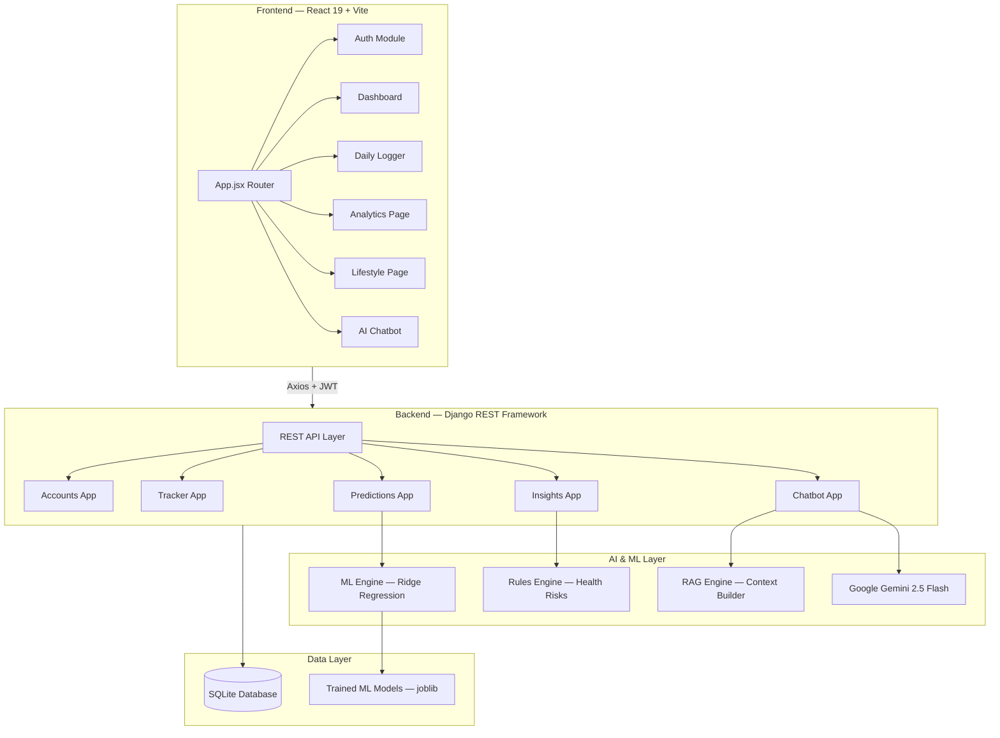
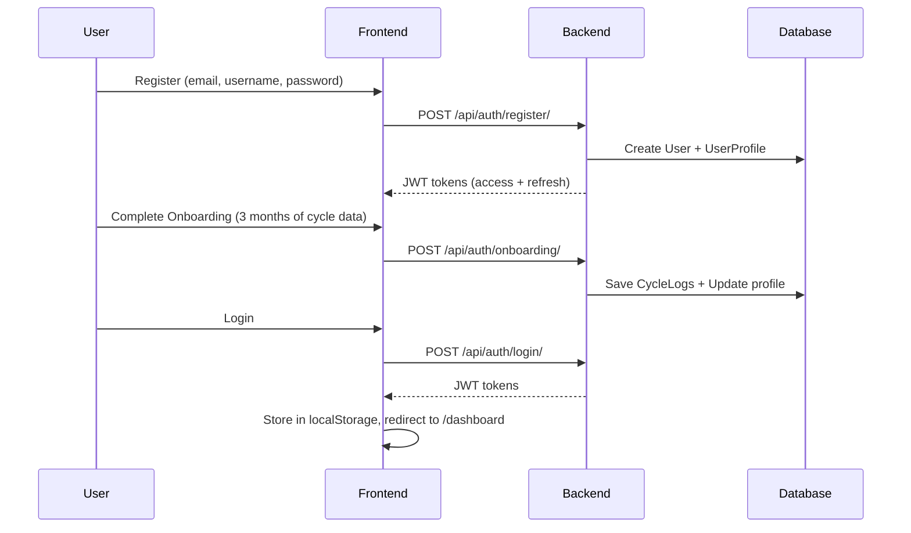
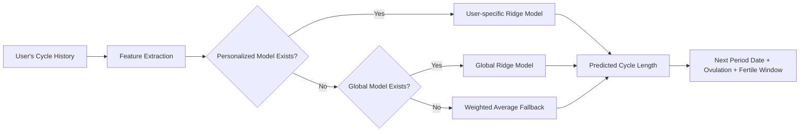

# SYNCHER — Complete Project Walkthrough

**SYNCHER** is a full-stack **women's health & menstrual cycle tracking platform** with AI-powered predictions, personalized health insights, and an intelligent chatbot assistant.

---

## 🏗️ Architecture Overview



---

## 🗂️ Project Structure

| Layer | Path | Tech |
|-------|------|------|
| **Frontend** | `frontend/` | React 19, Vite 8, React Router 7, Recharts, Framer Motion, Axios |
| **Backend** | `backend/` | Django 5.2, DRF, SimpleJWT, CORS Headers |
| **ML/AI** | `backend/apps/predictions/` + `backend/apps/chatbot/` | scikit-learn, NumPy, Pandas, Google Generative AI |
| **Database** | `backend/db.sqlite3` | SQLite |
| **ML Models** | `backend/ml_models/saved/` | joblib serialized models |

---

## 🔧 Backend — Django Apps

### 1. `accounts` — Authentication & User Profiles

| File | Purpose |
|------|---------|
| [models.py](file:///c:/Users/akile/OneDrive/Desktop/SYNCHERV1/backend/apps/accounts/models.py) | Custom `User` model (email-based login) + `UserProfile` (weight, height, avg cycle/period length, activity level, onboarding status) |
| [serializers.py](file:///c:/Users/akile/OneDrive/Desktop/SYNCHERV1/backend/apps/accounts/serializers.py) | Registration, login, profile serializers |
| [views.py](file:///c:/Users/akile/OneDrive/Desktop/SYNCHERV1/backend/apps/accounts/views.py) | Register, Login (JWT), Profile CRUD, Onboarding endpoint |

**Key Models:**
- **`User`** — extends `AbstractUser`, uses **email** as the login field
- **`UserProfile`** — health metadata: weight (kg), height (cm), avg cycle length, avg period length, activity level, onboarding completion flag

---

### 2. `tracker` — Cycle & Daily Health Tracking

| File | Purpose |
|------|---------|
| [models.py](file:///c:/Users/akile/OneDrive/Desktop/SYNCHERV1/backend/apps/tracker/models.py) | `CycleLog`, `DailyLog`, `Symptom` models |
| [services.py](file:///c:/Users/akile/OneDrive/Desktop/SYNCHERV1/backend/apps/tracker/services.py) | Core business logic: cycle stats, current phase detection, next period prediction |
| [views.py](file:///c:/Users/akile/OneDrive/Desktop/SYNCHERV1/backend/apps/tracker/views.py) | Dashboard API, Cycle CRUD, Daily Log CRUD |

**Key Models:**
- **`CycleLog`** — tracks each menstrual cycle: start/end date, cycle length, period length, predicted flag, notes
- **`DailyLog`** — daily entries with period status, pain level (0–5), mood (7 options), flow intensity, sleep hours, stress level (0–5), exercise minutes, water intake
- **`Symptom`** — symptoms linked to daily logs: 13 categories (cramps, headache, bloating, etc.) with severity (1–5)

**Key Services:**
- `get_cycle_stats()` → avg cycle length, std deviation, regularity score (0–100)
- `get_current_phase()` → determines menstrual / follicular / ovulation / luteal phase
- `get_next_period_info()` → predicts next period + ovulation + fertile window dates

---

### 3. `predictions` — ML-Powered Cycle Predictions

| File | Purpose |
|------|---------|
| [ml_engine.py](file:///c:/Users/akile/OneDrive/Desktop/SYNCHERV1/backend/apps/predictions/ml_engine.py) | Feature extraction, prediction, and model training |
| [models.py](file:///c:/Users/akile/OneDrive/Desktop/SYNCHERV1/backend/apps/predictions/models.py) | `PredictionResult` storage |

**ML Pipeline:**
1. **Feature Extraction** — uses last 3 cycle lengths + rolling average + rolling std deviation
2. **Prediction** — tries user-specific model → global model → weighted-average fallback
3. **Model Training** — `Ridge` regression, personalized per user, saved as `.joblib` files
4. **Confidence Scoring** — increases with more tracked cycles (0.3 → 0.95)
5. **Outputs**: predicted cycle length, next period date, ovulation date, fertile window

---

### 4. `insights` — Health Insights & Recommendations

| File | Purpose |
|------|---------|
| [rules_engine.py](file:///c:/Users/akile/OneDrive/Desktop/SYNCHERV1/backend/apps/insights/rules_engine.py) | 5 rule-based health checks |
| [recommendation.py](file:///c:/Users/akile/OneDrive/Desktop/SYNCHERV1/backend/apps/insights/recommendation.py) | Phase-aware personalized recommendations |
| [models.py](file:///c:/Users/akile/OneDrive/Desktop/SYNCHERV1/backend/apps/insights/models.py) | `Insight` and `Recommendation` models |

**Rules Engine Checks:**
| Check | What It Detects |
|-------|-----------------|
| Cycle Irregularity | Std dev > 4 or > 7 days → warning/alert; also flags cycles > 38 or < 21 days |
| Pain Patterns | Avg pain ≥ 3 or ≥ 5 high-pain days → warning/alert for possible endometriosis |
| Flow Patterns | ≥ 7 heavy-flow days → alert for possible anemia risk |
| Mood Patterns | > 60% negative mood days → warning with cycle-phase correlation |
| Lifestyle Impact | Avg sleep < 6h or avg stress ≥ 3.5 → hormonal disruption warnings |

**Recommendation Types:** Diet, Exercise, Sleep, Productivity, Self Care, General — all phase-aware

---

### 5. `chatbot` — AI Health Assistant

| File | Purpose |
|------|---------|
| [llm_service.py](file:///c:/Users/akile/OneDrive/Desktop/SYNCHERV1/backend/apps/chatbot/llm_service.py) | Google Gemini 2.5 Flash integration with system prompt |
| [rag_engine.py](file:///c:/Users/akile/OneDrive/Desktop/SYNCHERV1/backend/apps/chatbot/rag_engine.py) | Builds personalized context from user health data |
| [models.py](file:///c:/Users/akile/OneDrive/Desktop/SYNCHERV1/backend/apps/chatbot/models.py) | `ChatHistory` model |

**How it works:**
1. **RAG Engine** gathers user's profile, cycle stats, current phase, next period prediction, symptom averages, and recent daily logs
2. **LLM Service** sends this context + chat history (last 10 messages) to **Gemini 2.5 Flash**
3. **System prompt** ensures the AI acts as a women's health assistant (not a doctor), is empathetic, and stays on-topic
4. API key configured via `GEMINI_API_KEY` environment variable

---

## ⚛️ Frontend — React Application

### Routing & Guards ([App.jsx](file:///c:/Users/akile/OneDrive/Desktop/SYNCHERV1/frontend/src/App.jsx))

| Route | Page | Guard |
|-------|------|-------|
| `/login` | Login Page | Redirects if authenticated |
| `/register` | Register Page | Redirects if authenticated |
| `/onboarding` | Onboarding Flow | Protected (must be logged in) |
| `/dashboard` | Main Dashboard | Onboarded (must complete onboarding) |
| `/log` | Daily Logger | Onboarded |
| `/analytics` | Analytics Page | Onboarded |
| `/lifestyle` | Lifestyle Page | Onboarded |
| `/chat` | AI Chatbot | Onboarded |

### Feature Modules

| Module | Path | What It Does |
|--------|------|--------------|
| **auth** | `features/auth/` | Login, Register, multi-step Onboarding flow with 3-month data entry |
| **dashboard** | `features/dashboard/` | Cycle calendar, phase display, period countdown, quick stats |
| **tracker** | `features/tracker/` | Daily logging: mood, pain, flow, sleep, stress, exercise, water, symptoms |
| **insights** | `features/insights/` | Analytics charts (Recharts), health alerts, pattern analysis |
| **lifestyle** | `features/lifestyle/` | Phase-aware recommendations for diet, exercise, sleep, self-care |
| **chatbot** | `features/chatbot/` | Chat UI for the AI health assistant |

### Shared Components & Context

| File | Role |
|------|------|
| [Layout.jsx](file:///c:/Users/akile/OneDrive/Desktop/SYNCHERV1/frontend/src/components/Layout.jsx) | App shell with sidebar navigation |
| [CycleCalendar.jsx](file:///c:/Users/akile/OneDrive/Desktop/SYNCHERV1/frontend/src/components/CycleCalendar.jsx) | Interactive cycle calendar component |
| [AuthContext.jsx](file:///c:/Users/akile/OneDrive/Desktop/SYNCHERV1/frontend/src/context/AuthContext.jsx) | Authentication state management (JWT tokens in localStorage) |
| [ThemeContext.jsx](file:///c:/Users/akile/OneDrive/Desktop/SYNCHERV1/frontend/src/context/ThemeContext.jsx) | Dark/Light mode toggle |

### API Client ([client.js](file:///c:/Users/akile/OneDrive/Desktop/SYNCHERV1/frontend/src/api/client.js))

Axios-based client with:
- **Request interceptor** — auto-attaches JWT access token
- **Response interceptor** — auto-refreshes expired tokens using refresh token
- **5 API modules**: `authAPI`, `trackerAPI`, `predictionAPI`, `insightsAPI`, `chatAPI`

---

## 🔐 Authentication Flow



---

## 🧠 ML Prediction Pipeline



**Features used**: Last 3 cycle lengths, rolling average, rolling standard deviation
**Training trigger**: User can manually trigger model training via the API

---

## 🚀 How to Run

### Backend
```bash
cd backend
pip install -r requirements.txt        # Install dependencies
python manage.py migrate               # Run migrations
python manage.py runserver             # Start on http://localhost:8000
```

### Frontend
```bash
cd frontend
npm install                            # Install dependencies
npm run dev                            # Start Vite dev server (http://localhost:5173)
```

### Environment Variables
Create `backend/.env`:
```
GEMINI_API_KEY=your_google_gemini_api_key
```

---

## 📊 API Endpoints Summary

| Method | Endpoint | Description |
|--------|----------|-------------|
| POST | `/api/auth/register/` | User registration |
| POST | `/api/auth/login/` | JWT login |
| GET/PATCH | `/api/auth/profile/` | User profile |
| POST | `/api/auth/onboarding/` | Complete onboarding |
| POST | `/api/token/refresh/` | Refresh JWT token |
| GET | `/api/tracker/dashboard/` | Dashboard data |
| GET/POST | `/api/tracker/cycles/` | Cycle logs |
| GET/POST | `/api/tracker/daily/` | Daily logs |
| GET | `/api/tracker/daily/today/` | Today's log |
| GET | `/api/predictions/predict/` | Get predictions |
| POST | `/api/predictions/train/` | Train ML model |
| GET | `/api/predictions/symptom-analytics/` | Symptom analytics |
| GET | `/api/insights/` | Health insights |
| POST | `/api/insights/{id}/dismiss/` | Dismiss insight |
| GET | `/api/insights/recommendations/` | Recommendations |
| POST | `/api/chat/` | Send chat message |
| GET | `/api/chat/history/` | Chat history |
| DELETE | `/api/chat/history/` | Clear chat history |
